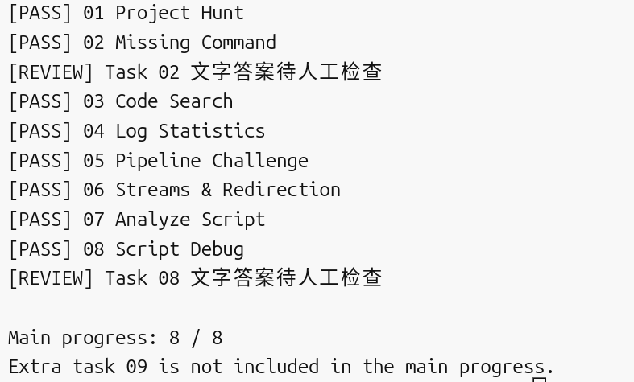

# Linux & Shell

这次主要学了这些

- `pwd` 看现在在哪个目录
- `ls` 看目录里有哪些文件，`ls -a` 连隐藏文件一起看
- `cd` 切目录
- `find` 找文件，`grep` 在内容里找东西
- 相对路径就是从现在的位置开始写，绝对路径是从根目录开始写
- `chmod` 可以改文件权限，`+x` 是加执行权限
- 直接输入一个命令名时 Shell 会去 PATH 里的目录找对应的程序
- `|` 会把前一个命令的输出交给后一个命令
- `>` 把 stdout 写进文件，`2>` 是把 stderr 写进文件
- `tee` 可以一边在终端显示一边写进文件
- `grep`、`cut`、`sort`、`uniq` 可以串起来处理日志
- Shell 变量最好注意引号，`"$var"` 不会因为里面有空格就被拆成多个参数

## 最终检查结果

